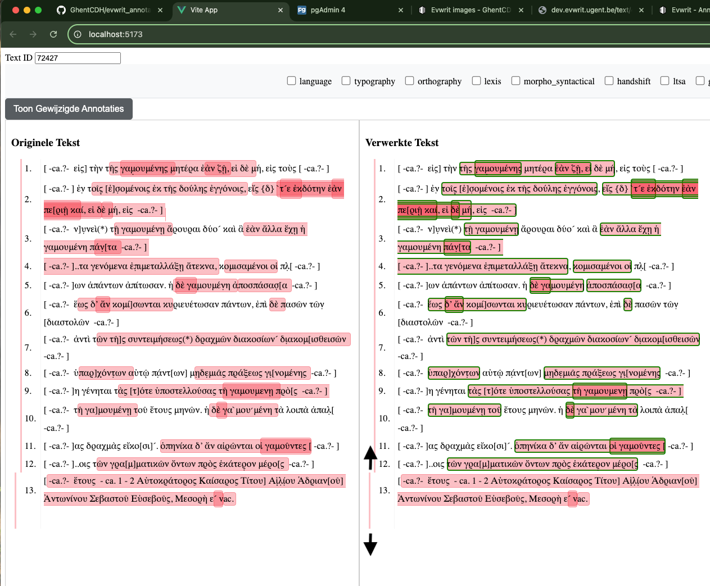
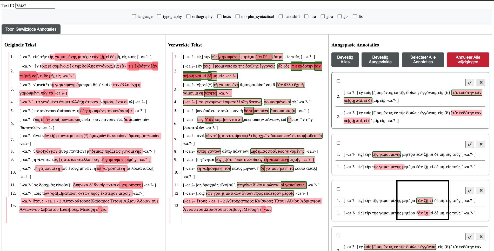

# Vue Annotation Manager

This project processes and manages text annotations using a set of predefined rules. Each annotation has a start and end character index, along with metadata. The system allows users to edit, filter, and apply custom rules to annotations and text, ensuring that character indices are properly aligned with the content. The tool provides real-time visualization for original, processed, and modified annotations using the [vue-component-annotated-text](https://www.npmjs.com/package/@ghentcdh/vue-component-annotated-text) package.


## Using the Annotation Manager

1. **Text and Annotation Display**:
   - Input the `Text ID` and press **Enter** to fetch the corresponding text and annotations.
   - View original and processed annotations in a side-by-side layout.
   - Annotations are filtered and can be toggled based on their type (e.g., typography, orthography, language).
   
2. **Editing Annotations**:
   - You can interact with the `Processed Text` section to edit annotations.
   - Any modifications to annotations are temporarily stored until confirmed or canceled.
   
3. **Rules Application**:
   - Rules such as tokenization or text-based alignment can be applied to adjust character indices.
   - Toggle specific rules on or off using the interface to see how they impact annotations.
   - The system attempts to align annotations based on context and nearby tokens if an exact match isn't found.

4. **Confirm or Cancel Changes**:
   - Users can confirm all or selected annotations using the provided action buttons.
   - Modified annotations are clearly marked and displayed separately for review.

## Features

- **Text Filtering**: Apply filters to annotations by type.
- **Editable Annotations**: Annotations can be edited and modified in real time.
- **Rule-Based Fixing**: Character index fixes based on tokenization, text matches, and other rule sets.
- **Visualization**: Displays original, processed, and modified annotations side by side for comparison.

## Dependencies
The following packages are used for development:

- @ghentcdh/vue-component-annotated-text: A component for rendering annotated text.

- [Vue.js](https://vuejs.org/) and [Vite](https://vitejs.dev/) for frontend development.
- [vue-component-annotated-text](https://www.npmjs.com/package/@ghentcdh/vue-component-annotated-text) for rendering and visualizing annotated text.
- [Tokenizr](https://www.npmjs.com/package/tokenizr) to split text into tokens.
- [diff](https://www.npmjs.com/package/diff) to align original and modified texts.
- **Elasticsearch** via the [EvWrit elasticsearch](https://www.evwrit.ugent.be/) instance for fetching text and annotations.

## Setup and Installation

### Project Setup

1. Clone the repository:
   ```sh
   git clone https://github.com/GhentCDH/evwrit_annotation_flow.git
   cd Vue-Annotation-Manager
2. Install dependecncies:
   ```sh
   pnpm install
3. Run the development server:
   ```sh
   pnpm run dev

## Known Issues
1. Performance with Large Texts:
   - The UI may become unresponsive when dealing with very large texts or numerous annotaions.
2. Text Overflow in UI
   - In specific cases, particularly when there are numerous lines of annotations (e.g., annotations of type `morpho_syntactical`), the text may overflow its container boundaries. This can lead to layout issues where the text is no longer properly confined within its designated space, as illustrated in the provided screenshot.

   

   but when we turn this type off, we get the right layout

   
3. **Selection of More or Fewer Lines**:
   - In the screenshot where arrows are visible, users may need to select more or fewer lines for optimal viewing or interaction. It will allow for better control over the number of displayed lines.

   
4. **Incorrect Word Selection When Applying Rules**:
   - When applying certain rules, instead of simply shifting the start and end indices, an additional word is sometimes selected. This causes the annotation to incorrectly expand beyond the intended text segment, as highlighted in the screenshot.
   
5. **Right-to-Left Text Direction for Arabic**:
   - Currently, the application doesn't properly handle the right-to-left reading order for Arabic texts. There should be an option allowing users to switch to right-to-left (RTL) text alignment when working with Arabic or other RTL languages, ensuring correct display and interaction with annotations. As example the text with id 3.
